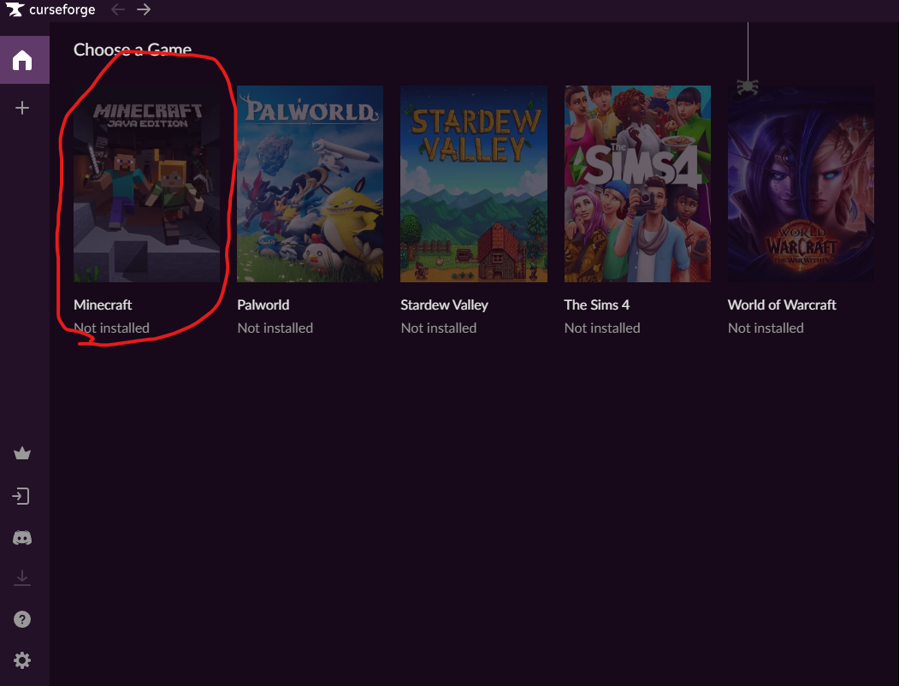
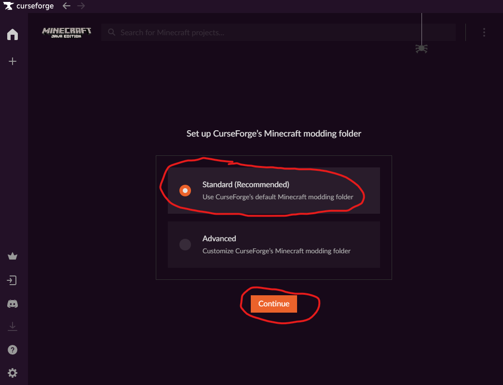
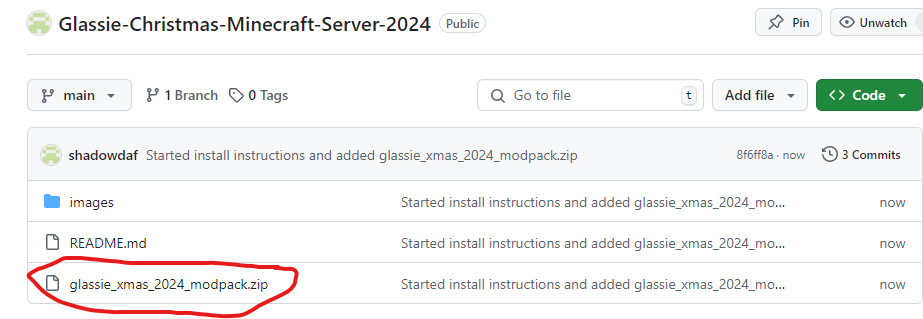
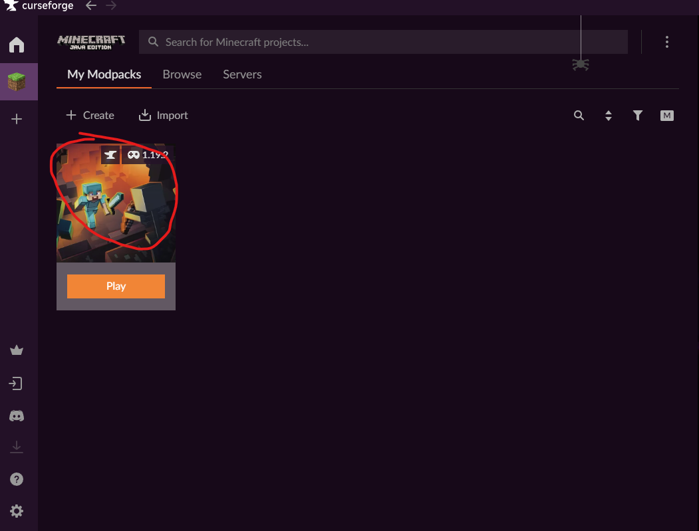
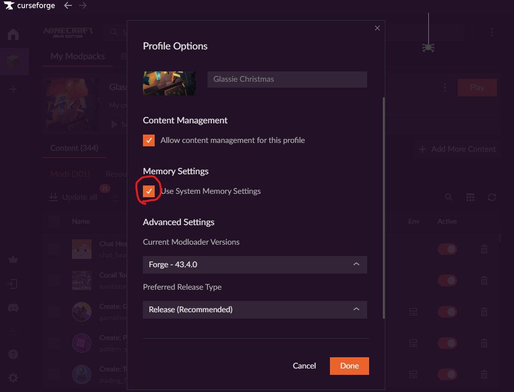

# Glassie-Christmas-Minecraft-Server-2024
This is a repository for the Glassie server minecraft server 2024. It contains the server zip file and instructions on setup.
# Installation Instructions
### Curseforge
Firstly, we need to install the curseforge launcher.

Go to the Cursforge website [here](https://www.curseforge.com/).

Download Cursforge, make sure it's the non-overwolf version, overwolf is basically malware.

Launch the installer, and follow the steps on there.

Now launch curseforge. Once launched, skip the intro.

Finally, if you have a curseforge account (not needed) login, otherwise continue as Guest.

Congrats, you have curseforge successfully installed!

## Modpack

We move onto installing the modpack. Firstly, let's make sure that curseforge has minecraft installed. Open curseforge, and click on minecraft to install it.

And use the default standard modding folder.

Now that minecraft has been installed, we need to add the modpack.

Click on the modpack file at the top of this page.

Then click download like so.

Save it wherever you want. **DO NOT UNZIP IT**. Next, the modpack needs to be imported into curseforge. So click on the import button inside the minecraft section of curseforge.

Then navigate to where you downloaded the zip file and click on it. The launcher will now download all the mods and configs for the pack.

**One last very important thing is you need to ensure it has enough RAM**. To do this, click on the modpack like so

Then click on the three dots at the top-ish right

and then choose the profile options button

Then disable the system settings under memory

And change then increase the RAM to the ~12000 MB (this is what the pack recomends but the modpack does work with 8192MB if that's all you can give)

Click done and you can now click play

## Minecraft

The final stage of setup is the Minecraft setup. Once you have clicked play on curseforge, you may be presented with setting up minecraft. Click on the login to Microsoft button. Login with your Microsoft account. Et Voila, youcan now play the Glassie Christmas Modded Minecraft Server 2024.

